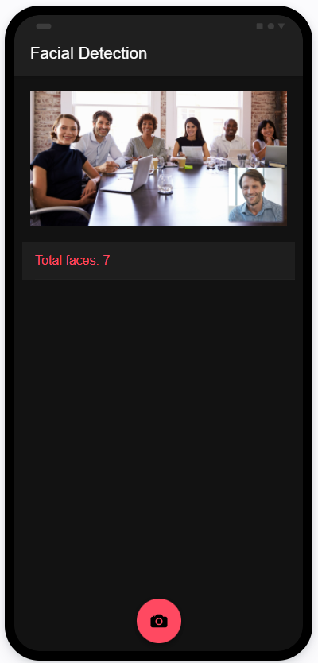

# facial-detection

An ionic application that integrates with Google Cloud Vision API for face detection.
Upload a photo and the application will show the count of faces detected within the photo.

## Local Setup for Development

### Prerequisites:
1. Node.js
1. Editor (recommended: Visual Sudio Code)
1. Android Studio (to build on Android)

### Steps
1. Ensure you have Ionic CLI installed on you PC globally:
    ```
    npm install -g @ionic/cli native-run cordova-res
    ```

1. Clone this repository
    ```
    git clone git@github.com:yuanshingk/facial-detection.git
    ```

1. Navigate into `/facial-detection` folder and run the following commands
    ```
    npm install
    ```

    ```
    ionic serve
    ```

## Demo
Check out the web view [here](https://dashboard.ionicframework.com/preview/91e31588/qngmhsxp03)

Screenshot:



